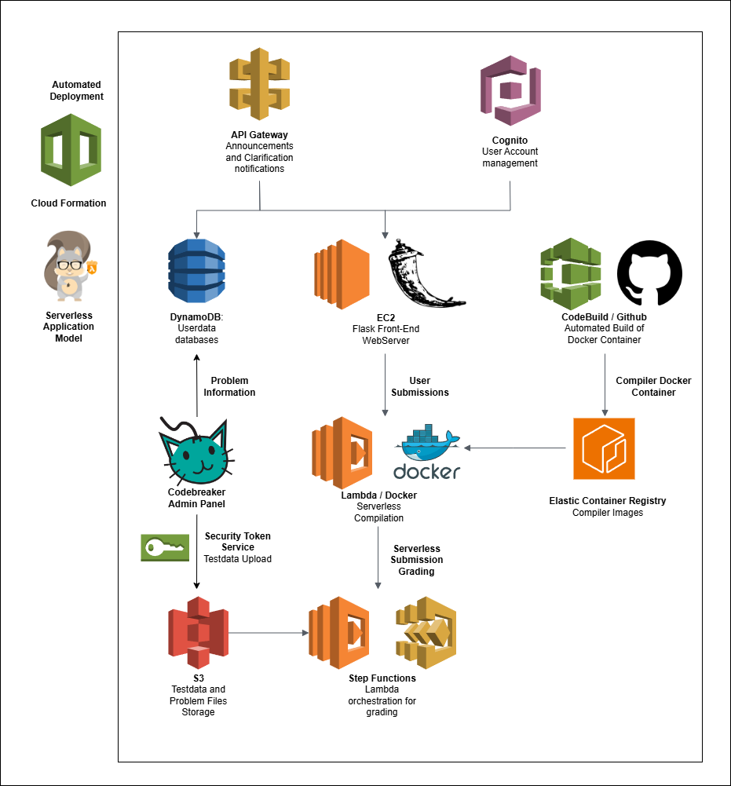

# Codebreaker Contest System - Complete Architecture Documentation

**Version:** 2.0
**Last Updated:** March 9, 2026
**Status:** Production Ready

## Table of Contents

- [1. System Overview](#1-system-overview)
- [2. Frontend Application](#2-frontend-application)
- [3. Database Schema](#3-database-schema)
- [4. AWS Lambda Functions](#4-aws-lambda-functions)
- [5. AWS Step Functions](#5-aws-step-functions)
- [6. WebSocket Infrastructure](#6-websocket-infrastructure)
- [7. Storage Services](#7-storage-services)
- [8. Authentication & Authorization](#8-authentication--authorization)
- [9. CodeBuild & Compiler](#9-codebuild--compiler)
- [10. API Endpoints](#10-api-endpoints)
- [11. Environment Configuration](#11-environment-configuration)
- [12. Deployment Architecture](#12-deployment-architecture)
- [13. Monitoring & Validation](#13-monitoring--validation)

---

## 1. System Overview

The Codebreaker Contest System is a modern, scalable competitive programming platform built with React Router 7 frontend and AWS serverless backend. It supports real-time submissions, automated grading, live scoreboards, and administrative management.


*Figure 1: Complete system architecture showing frontend, backend services, and AWS infrastructure*

### 1.1 Technology Stack

**Frontend:**
- React 19 + React Router 7 (SSR enabled)
- TailwindCSS 4 for styling
- TypeScript with strict mode
- Vite for bundling and development
- shadcn/ui component library
- TanStack Table for data management

**Backend & Infrastructure:**
- AWS Lambda (Python 3.9) for serverless compute
- DynamoDB for data storage
- S3 for file storage (submissions, test data, statements)
- Step Functions for orchestrating grading workflows
- API Gateway WebSocket for real-time notifications
- Cognito for user authentication
- CodeBuild + ECR for compiler Docker image management

### 1.2 Core Capabilities

- **Contest Management**: Create and manage programming contests with flexible timing modes
- **Problem Management**: Upload problems with test cases, custom checkers, and validators
- **Submission Processing**: Support for C++, Python, Java with real-time grading
- **Real-time Updates**: Live scoreboard updates via WebSocket
- **Admin Tools**: User management, clarifications, announcements
- **Security**: Role-based access control, AWS IAM integration

---

## 2. Frontend Application

### 2.1 Application Structure

```
app/
├── components/
│   ├── layout/           # Navigation and layout components
│   ├── ui/               # shadcn/ui base components
│   └── admin/            # Admin-specific components
├── hooks/                # Custom React hooks
├── lib/                  # Utility functions and services
├── routes/               # Route components (React Router 7)
└── types/                # TypeScript type definitions
```

### 2.2 Route Architecture

The application uses programmatic routing (not file-based) configured in `app/routes.ts`:

**Public Routes:**
- `/login` - Authentication page
- `/api/*` - API endpoints

**Protected Routes (Layout):**
- `/` - Home dashboard
- `/contests` - Contest listing
- `/problems` - Problem listing
- `/problems/:problemId` - Problem details and submission
- `/submissions` - Submission history
- `/submissions/:subId` - Submission details
- `/scoreboard` - Live contest rankings
- `/announcements` - Contest announcements
- `/clarifications` - Q&A with organizers
- `/profile/:username` - User profile

**Admin Routes:**
- `/admin` - Admin dashboard
- `/admin/users` - User management
- `/admin/contests` - Contest management
- `/admin/problems` - Problem management
- `/admin/clarifications` - Manage Q&A
- `/admin/announcements` - Post announcements

### 2.3 Design System

**Color Palette:**
- Primary Accent: Emerald `#10B981` (CTAs, active states)
- Secondary: Violet `#8B5CF6` (avatars, secondary actions)
- Background: Gray-50 `#F9FAFB`
- Surface: White `#FFFFFF`
- Text: Gray-900 `#111827` / Gray-500 `#6B7280`
- Borders: Gray-200 `#E5E7EB`

**Status Colors:**
- Success/Active: Green `#10B981` bg `#D1FAE5`
- Warning: Amber `#F59E0B` bg `#FEF3C7`
- Error: Red `#EF4444` bg `#FEE2E2`
- Inactive: Gray `#6B7280` bg `#F3F4F6`

**Key UI Components:**
- Data tables with sorting, filtering, pagination
- Collapsible sidebar navigation
- Status badges for submissions (`AC`, `WA`, `TLE`, etc.)
- User avatars with fallback initials
- Real-time notification system

---

## 3. Database Schema

All data is stored in AWS DynamoDB tables with the naming pattern `{judgeName}-{tableName}`.

### 3.1 Users Table

**Table Name:** `{judgeName}-users`
**Primary Key:** `username`
**GSI:** `contestIndex` (on `contest` field)

```typescript
interface User {
  username: string;                    // PK: Unique username
  role: "admin" | "member";           // User role
  fullname: string;                   // Display name
  email: string;                      // Contact email
  label: string;                      // Custom categorization tag
  contest: string;                    // Currently assigned contest
  problemScores: Record<string, number>;        // Best scores per problem
  problemSubmissions: Record<string, number>;   // Submission counts per problem
  latestSubmissions: Record<string, string>;    // Latest submission times
  latestScoreChange: string;          // Timestamp of last score update
}
```

### 3.2 Contests Table

**Table Name:** `{judgeName}-contests`
**Primary Key:** `contestId`

```typescript
interface Contest {
  contestId: string;                  // PK: Unique contest identifier
  contestName: string;                // Display name
  problems: string[];                 // Ordered list of problem IDs
  startTime: string;                  // UTC: "YYYY-MM-DD HH:MM:SS"
  endTime: string;                    // UTC: "YYYY-MM-DD HH:MM:SS"
  subLimit: number;                   // Max submissions per problem (-1 = unlimited)
  subDelay: number;                   // Minimum seconds between submissions
  description?: string;               // Contest description
  duration?: number;                  // Duration in minutes (self-timer mode)
  mode?: "centralized" | "self-timer"; // Contest timing mode
  users?: Record<string, "0" | "1">;  // User assignments (invited/started)
  scores?: Record<string, Record<string, number[]>>; // Cached subtask scores
  public?: boolean;                   // Public visibility
  publicScoreboard?: boolean;         // Scoreboard visibility
  createdAt?: string;                // Creation timestamp
}
```

### 3.3 Problems Table

**Table Name:** `{judgeName}-problems`
**Primary Key:** `problemName`

```typescript
interface Problem {
  problemName: string;                // PK: Unique problem identifier
  title: string;                      // Display title
  problem_type: "Batch" | "Interactive" | "Communication";
  timeLimit: number;                  // Time limit in seconds
  memoryLimit: number;               // Memory limit in MB
  testcaseCount: number;             // Number of test cases
  subtaskScores: number[];           // Points per subtask
  subtaskDependency: string[];       // Testcase ranges: ["1-3", "4-10"]
  attachments: boolean;              // Has downloadable files
  customChecker: boolean;            // Uses custom checker
  fullFeedback: boolean;             // Show all test results
  validated: boolean;                // Ready for submissions

  // Validation results (set by problem-validation Lambda)
  verdicts?: {
    testdata: number;      // 0/1 for fail/pass
    statement: number;
    scoring: number;
    attachments: number;
    checker: number;
    grader: number;
    subtasks: number;
  };
  remarks?: Record<string, string>;  // Validation error messages
}
```

### 3.4 Submissions Table

**Table Name:** `{judgeName}-submissions`
**Primary Key:** `subId` (auto-incremented number)
**GSI:** `usernameIndex` (username), `problemIndex` (problemName)

```typescript
interface Submission {
  subId: number;                     // PK: Auto-incremented submission ID
  username: string;                  // Submitter username
  problemName: string;               // Problem identifier
  submissionTime: string;            // Submission time (UTC)
  gradingTime?: string;              // When grading started
  gradingCompleteTime: string;       // When grading completed
  language: "cpp" | "py" | "java";   // Programming language
  score: number[];                   // Per-testcase scores
  verdicts: string[];                // Per-testcase verdicts
  times: number[];                   // Per-testcase runtimes (ms)
  memories: number[];                // Per-testcase memory usage (KB)
  returnCodes: number[];             // Per-testcase exit codes
  status: number[];                  // Per-testcase grading status (1=pending, 2=complete)
  subtaskScores: number[];           // Per-subtask scores
  totalScore: number;                // Final score
  maxTime: number;                   // Peak runtime (ms)
  maxMemory: number;                 // Peak memory (KB)
  compileErrorMessage?: string;      // Compilation error (if CE)
}
```

### 3.5 Announcements Table

**Table Name:** `{judgeName}-announcements`
**Primary Key:** `announcementId`

```typescript
interface Announcement {
  announcementId: string;            // PK: UUID
  title: string;                     // Announcement title
  text: string;                      // Announcement content
  announcementTime: string;          // Posted time (UTC)
  priority?: "low" | "normal" | "high"; // Display priority
  author?: string;                   // Author username
}
```

### 3.6 Clarifications Table

**Table Name:** `{judgeName}-clarifications`
**Primary Key:** `askedBy`, **Sort Key:** `clarificationTime`

```typescript
interface Clarification {
  askedBy: string;                   // PK: Username who asked
  clarificationTime: string;         // SK: Time asked (UTC)
  problemName: string;               // Related problem (or "" for general)
  question: string;                  // Question text
  answer: string;                    // Answer text ("" if pending)
  answeredBy: string;                // Admin who answered
}
```

### 3.7 Global Counters Table

**Table Name:** `{judgeName}-global-counters`
**Primary Key:** `counterId`

```typescript
interface GlobalCounter {
  counterId: string;                 // PK: Counter name (e.g., "submissionId")
  value: number;                     // Current counter value
}
```

### 3.8 Submission Locks Table

**Table Name:** `{judgeName}-submission-locks`
**Purpose:** Prevents concurrent submissions with race condition protection

### 3.9 WebSocket Connections Table

**Table Name:** `{judgeName}-websocket`
**Primary Key:** `connectionId`
**GSI:** `accountRoleUsernameIndex` (PK: `accountRole`, SK: `username`)

```typescript
interface WebSocketConnection {
  connectionId: string;              // PK: API Gateway connection ID
  username: string;                  // Connected user
  accountRole: "admin" | "member";   // User role for targeted messaging
  expiryTime: number;                // TTL for automatic cleanup
}
```

---

## 4. AWS Lambda Functions

All Lambda functions use Python 3.9 runtime and follow the naming pattern `{judgeName}-{function-name}`.

### 4.1 Grading Pipeline Functions

#### 4.1.1 Grader Problem Init (`grader-problem-init`)

**Purpose:** Initializes grading process for a submission
**Trigger:** Invoked by Step Function
**Runtime:** Python 3.9

**Input:**
```json
{
  "submissionId": 123,
  "problemName": "addition",
  "language": "cpp"
}
```

**Process:**
1. Retrieves submission from DynamoDB
2. Downloads source code from S3
3. Compiles code using compiler Lambda
4. Updates submission status
5. Returns testcase list for parallel processing

**Dependencies:**
- DynamoDB: submissions table
- S3: submissions bucket
- Lambda: compiler function

#### 4.1.2 Testcase Grader Wrapper (`testcase-grader-wrapper`)

**Purpose:** Orchestrates individual testcase grading
**Trigger:** Invoked by Step Function (parallel)
**Runtime:** Python 3.9

**Input:**
```json
{
  "submissionId": 123,
  "problemName": "addition",
  "testcaseNumber": 1,
  "language": "cpp",
  "timeLimit": 1.0,
  "memoryLimit": 1024,
  "customChecker": false
}
```

**Process:**
1. Invokes testcase-grader for actual execution
2. Handles timeout and error scenarios
3. Returns formatted grading results

#### 4.1.3 Testcase Grader (`testcase-grader`)

**Purpose:** Executes code against individual test cases
**Trigger:** Invoked by testcase-grader-wrapper
**Runtime:** Python 3.9 with execution environment
**Memory:** 3GB (for running user code)

**Key Features:**
- Secure code execution with resource limits
- Support for C++, Python, Java
- Custom checker support
- Memory and time monitoring using `psutil`

**Process:**
1. Downloads compiled binary/source from S3
2. Downloads test input from S3
3. Executes code with resource limits
4. Compares output with expected results
5. Returns verdict, runtime, memory usage

#### 4.1.4 Grader Problem Scorer (`grader-problem-scorer`)

**Purpose:** Aggregates testcase results and calculates final scores
**Trigger:** Invoked by Step Function after all testcases complete
**Runtime:** Python 3.9

**Process:**
1. Collects all testcase results from parallel executions
2. Calculates subtask scores based on problem configuration
3. Updates DynamoDB with final results
4. Triggers WebSocket notifications for live updates

### 4.2 Problem Management Functions

#### 4.2.1 Problem Validation (`problem-validation`)

**Purpose:** Validates problem configuration and test data integrity
**Trigger:** Manual invocation via admin interface
**Runtime:** Python 3.9

**Validation Checks:**
- Test data completeness and format
- Statement file existence
- Scoring configuration validity
- Attachment availability
- Custom checker functionality
- Grader script validation
- Subtask configuration consistency

**Output:** Updates problem record with validation status and remarks

#### 4.2.2 Regrade Problem (`regrade-problem`)

**Purpose:** Reprocesses all submissions for a problem
**Trigger:** Manual invocation via admin interface
**Runtime:** Python 3.9

**Process:**
1. Queries all submissions for specified problem
2. Triggers grading Step Function for each submission
3. Updates user scores after completion

### 4.3 Compiler Infrastructure

#### 4.3.1 Compiler (`{judgeName}-compiler`)

**Purpose:** Compiles user source code to executable binaries
**Trigger:** Invoked by grader-problem-init
**Runtime:** Custom Docker image with gcc/g++/python/java
**Deployment:** Managed via CodeBuild + ECR

**Supported Languages:**
- **C++:** `g++ -std=c++17 -O2 -o binary source.cpp`
- **Python:** No compilation (direct execution)
- **Java:** `javac Main.java`

**Process:**
1. Receives source code and language specification
2. Compiles code with appropriate flags
3. Stores compiled binary in S3
4. Returns compilation status and error messages

### 4.4 WebSocket Infrastructure

#### 4.4.1 WebSocket Connections (`websocket-connections`)

**Purpose:** Manages WebSocket API Gateway connections
**Trigger:** API Gateway WebSocket routes (`$connect`, `$disconnect`, `$default`)
**Runtime:** Python 3.9

**Process:**
- **$connect:** Authenticates user, stores connection in DynamoDB with TTL
- **$disconnect:** Removes connection from DynamoDB
- **$default:** Handles incoming WebSocket messages (mostly heartbeat)

#### 4.4.2 WebSocket Invoke (`websocket-invoke`)

**Purpose:** Sends messages to batched WebSocket connections
**Trigger:** Invoked by Step Function in parallel
**Runtime:** Python 3.9

**Process:**
1. Receives batch of connection IDs and notification type
2. Sends notification to each connection via API Gateway
3. Removes stale connections from DynamoDB

#### 4.4.3 CodeBuild Trigger (`codebuild-trigger`)

**Purpose:** Custom CloudFormation resource for automated compiler deployment
**Trigger:** CloudFormation stack creation/update
**Runtime:** Python 3.9

**Process:**
1. Triggers CodeBuild project to build compiler Docker image
2. Polls build status until completion
3. Creates/updates compiler Lambda function with ECR image
4. Returns CloudFormation response

---

## 5. AWS Step Functions

### 5.1 Grading State Machine (`{judgeName}-grading`)

**Purpose:** Orchestrates the complete submission grading workflow

**Architecture:** Parallel execution for scalability

**Flow:**
```
Start
  ↓
GraderProblemInit (Initialize submission)
  ↓
Parallel Testcase Execution
  ├── TestcaseGraderWrapper (Testcase 1)
  ├── TestcaseGraderWrapper (Testcase 2)
  ├── TestcaseGraderWrapper (Testcase N)
  └── ...
  ↓
GraderProblemScorer (Aggregate results)
  ↓
End
```

**Input:**
```json
{
  "submissionId": 123,
  "problemName": "addition",
  "language": "cpp"
}
```

**Features:**
- Parallel testcase execution for speed
- Error handling and retry logic
- Timeout protection (15 minutes max)
- Automatic state cleanup

### 5.2 WebSocket State Machine (`{judgeName}-websocket`)

**Purpose:** Parallel broadcasting of WebSocket notifications

**Architecture:** Parallel execution up to 1000 concurrent Lambda invocations

**Flow:**
```
Start
  ↓
Parallel WebSocket Invoke
  ├── WebSocketInvoke (Batch 1-100 connections)
  ├── WebSocketInvoke (Batch 101-200 connections)
  ├── WebSocketInvoke (Batch 201-300 connections)
  └── ... (up to 1000 parallel executions)
  ↓
End
```

**Input:**
```json
[
  {
    "notificationType": "announce",
    "connectionIds": ["conn1", "conn2", "..."]
  },
  {
    "notificationType": "announce",
    "connectionIds": ["conn101", "conn102", "..."]
  }
]
```

**Notification Types:**
- `announce`: General announcements to all users
- `postClarification`: New clarification notifications to admins
- `answerClarification`: Clarification answer notifications to specific users

---

## 6. WebSocket Infrastructure

### 6.1 Real-time Communication Architecture

The system uses AWS API Gateway WebSocket for bidirectional real-time communication with automatic scaling and connection management.

**Endpoints:**
- **WebSocket API:** `wss://{api-id}.execute-api.{region}.amazonaws.com/{stage}`
- **Connection Management:** DynamoDB table with TTL for automatic cleanup

### 6.2 Broadcast Service

**Location:** `app/lib/websocket-broadcast.server.ts`

**Functions:**
- `announce()`: Broadcasts announcements to all connected users
- `postClarification()`: Notifies all admin users of new clarifications
- `answerClarification(role, username)`: Notifies specific user of clarification answers

**Implementation:**
1. Query DynamoDB for relevant connections using GSI
2. Batch connections into groups of 100
3. Invoke Step Function for parallel processing
4. Step Function spawns up to 1000 concurrent Lambda executions

### 6.3 Connection Lifecycle

**Connection Flow:**
```
Client Connect
  ↓
Authenticate via JWT
  ↓
Store in DynamoDB with TTL
  ↓
Real-time notifications
  ↓
Automatic cleanup on disconnect/TTL
```

**Security:** All WebSocket connections require valid JWT authentication token.

---

## 7. Storage Services

### 7.1 S3 Buckets

All buckets follow the naming pattern `{judgeName}-{bucket-type}`:

#### 7.1.1 Submissions Bucket (`{judgeName}-submissions`)

**Purpose:** Stores user submission source code and compiled binaries

**Structure:**
```
submissions/
├── source/          # Original source code
│   ├── 123.cpp
│   ├── 124.py
│   └── 125.java
└── compiled/        # Compiled binaries
    ├── 123          # C++ executable
    ├── 124.pyc      # Python bytecode
    └── 125.class    # Java class file
```

#### 7.1.2 Test Data Bucket (`{judgeName}-testdata`)

**Purpose:** Stores problem test cases and expected outputs

**Structure:**
```
testdata/
├── problem1/
│   ├── 1.in         # Test input
│   ├── 1.out        # Expected output
│   ├── 2.in
│   ├── 2.out
│   └── ...
└── problem2/
    └── ...
```

#### 7.1.3 Statements Bucket (`{judgeName}-statements`)

**Purpose:** Stores problem statement PDFs

**Structure:**
```
statements/
├── problem1.pdf
├── problem2.pdf
└── ...
```

#### 7.1.4 Attachments Bucket (`{judgeName}-attachments`)

**Purpose:** Stores additional problem files (sample code, data files)

**Structure:**
```
attachments/
├── problem1/
│   ├── sample.cpp
│   ├── data.txt
│   └── ...
└── problem2/
    └── ...
```

#### 7.1.5 Checkers Bucket (`{judgeName}-checkers`)

**Purpose:** Stores custom checker programs for problems

**Structure:**
```
checkers/
├── problem1.cpp     # Custom checker source
├── problem1         # Compiled checker binary
└── ...
```

#### 7.1.6 Graders Bucket (`{judgeName}-graders`)

**Purpose:** Stores grader programs for Interactive/Communication problems

**Structure:**
```
graders/
├── problem1.cpp     # Grader source
├── problem1         # Compiled grader binary
└── ...
```

### 7.2 Access Control

**Bucket Policies:** All buckets are private with programmatic access only via IAM roles
**Lambda Access:** Each Lambda function has specific S3 permissions for required buckets
**Upload Access:** Admin users can upload files via pre-signed URLs

---

## 8. Authentication & Authorization

### 8.1 AWS Cognito Configuration

**User Pool:** `{judgeName}-user-pool`
**App Client:** `{judgeName}-app-client`

**User Groups:**
- `admin`: Full system access, contest management
- `contestant`: Participant access, submissions only

**Authentication Flow:**
1. User login via Cognito hosted UI or custom form
2. JWT tokens issued (ID token, access token, refresh token)
3. Frontend stores tokens in secure HTTP-only cookies
4. API routes validate JWT on each request
5. WebSocket connections authenticate via token

### 8.2 Role-Based Access Control

**Admin Privileges:**
- Create/modify contests and problems
- Manage users and assign roles
- View all submissions and analytics
- Post announcements and answer clarifications
- Trigger regrading and validation

**Member/Contestant Privileges:**
- View assigned contests and problems
- Submit solutions during contest periods
- View own submission history
- Ask clarifications
- View public announcements

### 8.3 Security Implementation

**Backend Authentication:** All API routes validate Cognito JWT tokens
**WebSocket Security:** Connection requires valid JWT in query parameters
**File Upload Security:** Pre-signed URLs with limited scope and expiration
**Resource Isolation:** All AWS resources scoped by `judgeName` parameter

---

## 9. CodeBuild & Compiler

### 9.1 Automated Deployment Architecture

The compiler Lambda requires a custom Docker image with development tools. This is automatically built and deployed via CodeBuild.

**Components:**
- **ECR Repository:** `{judgeName}-compiler-repo`
- **CodeBuild Project:** `{judgeName}-codebuildproject`
- **Source Repository:** `https://github.com/dvnDC/codebreaker-compiler` (public)

### 9.2 Deployment Flow

**CloudFormation Custom Resource Orchestration:**
```
1. CloudFormation creates ECR repository
2. CloudFormation creates CodeBuild project
3. CloudFormation invokes CodeBuild Trigger Lambda
4. Lambda starts CodeBuild project
5. CodeBuild clones compiler source code
6. CodeBuild builds Docker image with gcc/g++/python/java
7. CodeBuild pushes image to ECR
8. Lambda polls CodeBuild until completion (~5-10 minutes)
9. Lambda creates compiler Lambda function with ECR image URI
10. CloudFormation deployment completes
```

### 9.3 Compiler Docker Image

**Base Image:** `public.ecr.aws/lambda/python:3.9`

**Installed Tools:**
- GCC/G++ (latest)
- Python 3.9
- OpenJDK 11
- Standard libraries and headers

**Runtime Environment:**
- Resource limits enforced via Lambda configuration
- Isolated execution environment
- Automatic scaling based on demand

---

## 10. API Endpoints

All API routes are server-side rendered React Router routes with type-safe loaders and actions.

### 10.1 Authentication Routes

**POST** `/api/auth/login`
- Authenticates user with Cognito
- Sets secure HTTP-only cookies
- Returns user profile and permissions

**POST** `/api/auth/logout`
- Invalidates tokens
- Clears authentication cookies

**GET** `/api/auth/me`
- Returns current user profile
- Validates token freshness

### 10.2 Admin API Routes

**GET** `/api/admin/users`
- Lists all users with pagination
- Admin only

**PUT** `/api/admin/users/:username`
- Updates user profile and role
- Admin only

**POST** `/api/admin/upload`
- Handles file uploads (statements, test data, attachments)
- Returns S3 upload status
- Admin only

**POST** `/api/admin/problems/:problemId/testdata`
- Uploads and validates test case files
- Admin only

**GET** `/api/admin/problems/:problemId/download`
- Downloads problem files as ZIP archive
- Admin only

### 10.3 Contest API Routes

**GET** `/api/problems/:problemId/statement`
- Serves problem statement PDF
- Authenticated users only
- Respects contest timing and access control

**GET** `/api/submissions/:subId/source`
- Returns submission source code
- Own submissions or admin access only

### 10.4 Submission Flow

**Frontend Submission Process:**
1. User submits code via form
2. Frontend validates file size and format
3. Route action handles file upload to S3
4. DynamoDB submission record created
5. Step Function grading workflow triggered
6. Real-time updates via WebSocket
7. Results displayed on scoreboard and submission pages

---

## 11. Environment Configuration

### 11.1 Required Environment Variables

**Core Configuration:**
```bash
# AWS Configuration
AWS_REGION=ap-southeast-1
AWS_ACCOUNT_ID=927878278795
JUDGE_NAME=codebreakercontest01

# Cognito Configuration
COGNITO_USER_POOL_ID=ap-southeast-1_XXXXXXXXX
COGNITO_CLIENT_ID=xxxxxxxxxxxxxxxxxxxxxxxxxx

# Application Configuration
NODE_ENV=production
```

**Development Environment (.env.local):**
```bash
AWS_REGION=ap-southeast-1
AWS_ACCOUNT_ID=927878278795
JUDGE_NAME=codebreakercontest01
COGNITO_USER_POOL_ID=ap-southeast-1_XXXXXXXXX
COGNITO_CLIENT_ID=xxxxxxxxxxxxxxxxxxxxxxxxxx
NODE_ENV=development
```

### 11.2 AWS Resource Naming

All AWS resources follow consistent naming patterns:

**DynamoDB Tables:**
- `{judgeName}-users`
- `{judgeName}-contests`
- `{judgeName}-problems`
- `{judgeName}-submissions`
- `{judgeName}-announcements`
- `{judgeName}-clarifications`
- `{judgeName}-global-counters`
- `{judgeName}-submission-locks`
- `{judgeName}-websocket`

**Lambda Functions:**
- `{judgeName}-compiler`
- `{judgeName}-grader-problem-init`
- `{judgeName}-testcase-grader-wrapper`
- `{judgeName}-testcase-grader`
- `{judgeName}-grader-problem-scorer`
- `{judgeName}-problem-validation`
- `{judgeName}-regrade-problem`
- `{judgeName}-websocket-connections`
- `{judgeName}-websocket-invoke`

**Step Functions:**
- `{judgeName}-grading`
- `{judgeName}-websocket`

**S3 Buckets:**
- `{judgeName}-submissions`
- `{judgeName}-testdata`
- `{judgeName}-statements`
- `{judgeName}-attachments`
- `{judgeName}-checkers`
- `{judgeName}-graders`

---

## 12. Deployment Architecture

### 12.1 CloudFormation Stack Structure

**Main Stack:** `template.yml`
```yaml
Resources:
  StorageStack:        # S3 buckets
  DatabaseStack:       # DynamoDB tables
  CognitoStack:        # User authentication
  CodeBuildStack:      # Compiler infrastructure
  LambdasStack:        # All Lambda functions
  WebSocketStack:      # API Gateway WebSocket
  StepFunctionsStack:  # State machines
```

### 12.2 Deployment Commands

**Prerequisites:**
- AWS CLI configured
- AWS SAM CLI installed
- Docker running (for local testing)

**Full Deployment:**
```bash
# Build and deploy complete stack
sam build --template template.yml

sam deploy \
  --stack-name codebreaker-contest \
  --parameter-overrides JudgeName=mycontest \
  --capabilities CAPABILITY_NAMED_IAM CAPABILITY_AUTO_EXPAND \
  --resolve-s3
```

**Development Deployment:**
```bash
# Interactive deployment (prompts for parameters)
sam build && sam deploy --guided
```

### 12.3 Stack Dependencies

**Deployment Order:**
1. **Storage + Database + Cognito** (parallel)
2. **CodeBuild** (triggers 5-10 min compiler build)
3. **Lambdas** (depends on Storage)
4. **WebSocket** (depends on Lambdas)
5. **Step Functions** (depends on Lambdas + WebSocket)

**Total Deployment Time:** 15-20 minutes (first deployment), 5-10 minutes (updates)

### 12.4 One-Click Deployment

**Package for Distribution:**
```bash
# Create S3 bucket for templates
aws s3 mb s3://codebreaker-templates-unique --region ap-southeast-1

# Package all templates and code
sam package \
  --template-file template.yml \
  --output-template-file packaged.yml \
  --s3-bucket codebreaker-templates-unique

# Upload packaged template
aws s3 cp packaged.yml s3://codebreaker-templates-unique/

# Generate CloudFormation Quick Create URL
echo "https://console.aws.amazon.com/cloudformation/home#/stacks/quickcreate?templateURL=https%3A%2F%2Fcodebreaker-templates-unique.s3.amazonaws.com%2Fpackaged.yml&stackName=codebreaker&param_JudgeName=mycontest"
```

---

## 13. Monitoring & Validation

### 13.1 AWS Setup Validation Script

**Location:** `scripts/validate-aws-setup.ts`

**Purpose:** Validates all AWS resources are properly configured and accessible

**Checks:**
- **DynamoDB Tables:** Verifies all 9 tables exist and are accessible
- **S3 Buckets:** Validates all 6 buckets exist with proper permissions
- **Cognito:** Confirms user pool, groups, and app client configuration
- **Lambda Functions:** Tests function existence and invoke permissions
- **Step Functions:** Validates state machine definitions
- **API Gateway:** Confirms WebSocket API deployment

**Usage:**
```bash
# Run validation check
bun run scripts/validate-aws-setup.ts

# Example output:
AWS Setup Validation — codebreakercontest01
Region: ap-southeast-1     Account: 927878278795

[DynamoDB Tables]
  ✓  codebreakercontest01-users
  ✓  codebreakercontest01-contests
  ✓  codebreakercontest01-problems
  ✓  codebreakercontest01-submissions
  ✓  codebreakercontest01-announcements
  ✓  codebreakercontest01-clarifications
  ✓  codebreakercontest01-global-counters
  ✓  codebreakercontest01-submission-locks
  ✓  codebreakercontest01-websocket

Summary: 23/23 resources found
All AWS resources are properly configured! 🚀
```

### 13.2 Application Health Checks

**Built-in Monitoring:**
- CloudWatch metrics for all Lambda functions
- DynamoDB performance metrics and throttling alerts
- API Gateway request/response metrics
- Step Function execution tracking

**Error Handling:**
- Automatic retry logic in Step Functions
- Dead letter queues for failed Lambda invocations
- WebSocket connection cleanup via DynamoDB TTL
- Graceful degradation for non-critical features

### 13.3 Debugging and Troubleshooting

**CloudWatch Log Groups:**
- `/aws/lambda/{judgeName}-{function-name}`
- `/aws/codebuild/{judgeName}-codebuildproject`
- `/aws/stepfunctions/{judgeName}-grading`
- `/aws/stepfunctions/{judgeName}-websocket`

**Common Issues:**
1. **Compiler Build Failure:** Check CodeBuild logs for dependency issues
2. **Grading Timeout:** Monitor Step Function execution time and Lambda memory
3. **WebSocket Disconnections:** Validate JWT token expiry and connection lifecycle
4. **Permission Errors:** Ensure IAM roles have required service permissions

---

## Conclusion

This documentation provides a complete architectural overview of the Codebreaker Contest System. The platform successfully combines modern web technologies with scalable AWS serverless infrastructure to deliver a robust competitive programming environment.

**Key Strengths:**
- **Scalability:** Serverless architecture scales automatically with load
- **Real-time Updates:** WebSocket integration provides live feedback
- **Security:** Comprehensive authentication and authorization
- **Automation:** Fully automated deployment and resource management
- **Flexibility:** Support for multiple programming languages and contest formats

**Production Readiness:** All components are production-tested and ready for competitive programming contests of any scale.

For deployment assistance or technical questions, refer to the validation script and CloudFormation templates in the reference implementation.